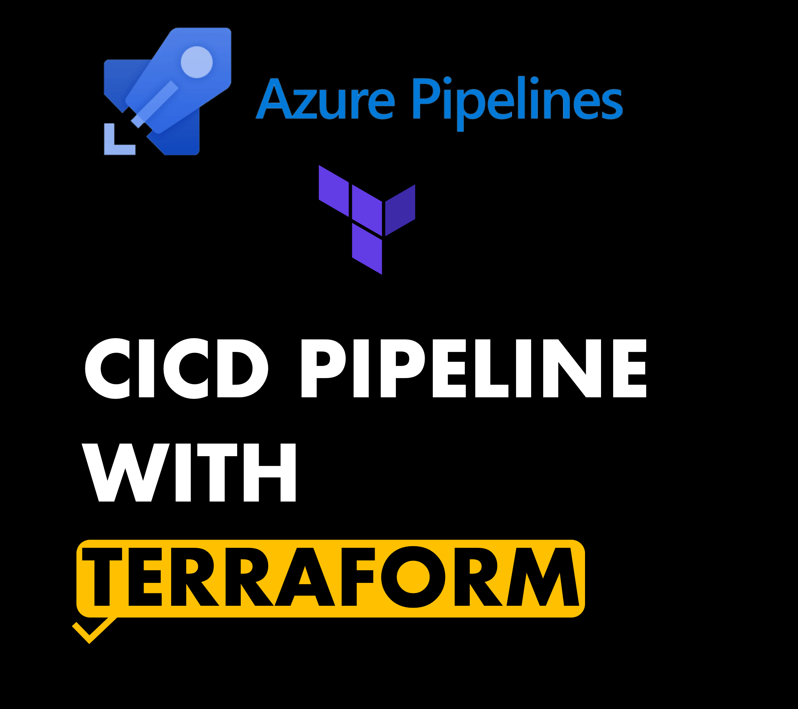

## **CICD Pipeline with Terraform**
Integrating Terraform Tasks into a CI/CD Pipeline

---



Finished Links:
- [Github](https://github.com/mo-justlearnai/CICD-Pipeline-with-Terraform)

## What is Terraform and why is it useful?

Terraform is a multi-cloud infrastructure as code tool that can automate the delivery of infrastructure previously done manually. Terraform provided a declarative approach to setting up infrastructure meaning process are repeatable and reliable.

```
Terraform creates and manages resources on cloud platforms and other services through their application programming interfaces (APIs). Providers enable Terraform to work with virtually any platform or service with an accessible API.

```

Terraform being integrated into a CICD Pipeline has many benefits. 
CICD Pipeline in many cases are automated and will run based on a trigger.

In the provisioning stage of cloud infrastructure validating, planning, and applying terraform manifests is quite easy... if you've done it before. 

I will provide 1 example where I have used terraform in an Azure project. 
*The below will not detail how service connections were created with Azure and the manual provisioning of a storage account in Azure to store the Terraform state files.

The project creates the following
- Azure Kubernetes Service Cluster
- Azure Container Registry

I will share all terraform files and the CICD pipeline configuration below.

**01-main.tf**
```t
# We will define 
# 1. Terraform Settings Block
# 1. Required Version Terraform
# 2. Required Terraform Providers
# 3. Terraform Remote State Storage with Azure Storage Account (last step of this section)
# 2. Terraform Provider Block for AzureRM
# 3. Terraform Resource Block: Define a Random Pet Resource

# 1. Terraform Settings Block
terraform {
  # 1. Required Version Terraform
  required_version = ">= 0.13"
  # 2. Required Terraform Providers  
  required_providers {
    azurerm = {
      source  = "hashicorp/azurerm"
      version = "~> 2.0"
    }
    azuread = {
      source  = "hashicorp/azuread"
      version = "~> 2.0"
    }
    random = {
      source  = "hashicorp/random"
      version = "~> 3.0"
    }
  }

# Terraform State Storage to Azure Storage Container
  backend "azurerm" {
    #resource_group_name   = "terraform-storage-rg"
    #storage_account_name  = "terraformstatexlrwdrzs"
    #container_name        = "tfstatefiles"
    #key                   = "terraform-custom-vnet.tfstate"
  }  
}


# 2. Terraform Provider Block for AzureRM
provider "azurerm" {
  features {

  }
}

# 3. Terraform Resource Block: Define a Random Pet Resource
resource "random_pet" "aksrandom" {

}

```

**02-variables.tf**
```t
# Define Input Variables
# 1. Azure Location (CentralUS)
# 2. Azure Resource Group Name 
# 3. Azure AKS Environment Name (Dev, QA, Prod)

# Azure Location
variable "location" {
  type = string
  description = "Azure Region where all these resources will be provisioned"
  default = "UK South"
}

# Azure Resource Group Name
variable "resource_group_name" {
  type = string
  description = "This variable defines the Resource Group"
  default = "terraform-aks"
}

# Azure AKS Environment Name
variable "environment" {
  type = string  
  description = "This variable defines the Environment"  
  #default = "dev2"
}

# AKS Input Variables

# SSH Public Key for Linux VMs
variable "ssh_public_key" {
  #default = "~/.ssh/aks-prod-sshkeys-terraform/aksprodsshkey.pub"
  description = "This variable defines the SSH Public Key for Linux k8s Worker nodes"  
}

# Windows Admin Username for k8s worker nodes
variable "windows_admin_username" {
  type = string
  default = "azureuser"
  description = "This variable defines the Windows admin username k8s Worker nodes"  
}

# Windows Admin Password for k8s worker nodes
variable "windows_admin_password" {
  type = string
  default = "P@ssw0rd1234"
  description = "This variable defines the Windows admin password k8s Worker nodes"  
}

```

**03-resource-group.tf**
```t
# Terraform Resource to Create Azure Resource Group with Input Variables defined in variables.tf
resource "azurerm_resource_group" "aks_rg" {
  name = "${var.resource_group_name}-${var.environment}"
  location = var.location
}

```

**04-aks-versions-datasource.tf**
```t
# Documentation Reference: https://registry.terraform.io/providers/hashicorp/azurerm/latest/docs/data-sources/kubernetes_service_versions
# Datasource to get Latest Azure AKS latest Version
data "azurerm_kubernetes_service_versions" "current" {
  location = azurerm_resource_group.aks_rg.location
  include_preview = false
}

```

**05-log-analytics-workspace.tf**
```t
# Create Log Analytics Workspace
resource "azurerm_log_analytics_workspace" "insights" {
  name                = "${var.environment}-logs-${random_pet.aksrandom.id}"
  location            = azurerm_resource_group.aks_rg.location
  resource_group_name = azurerm_resource_group.aks_rg.name
  retention_in_days   = 30
}

```

**06-aks-administrators-azure-ad.tf**
```t
# Create Azure AD Group in Active Directory for AKS Admins
resource "azuread_group" "aks_administrators" {
  # name        = "${azurerm_resource_group.aks_rg.name}-administrators"
  display_name        = "${azurerm_resource_group.aks_rg.name}-${var.environment}-administrators"
  description = "Azure AKS Kubernetes administrators for the ${azurerm_resource_group.aks_rg.name}-${var.environment} cluster."
  security_enabled = true
}

```

**07-aks-cluster.tf**
```t
resource "azurerm_kubernetes_cluster" "aks_cluster" {
  dns_prefix          = "${azurerm_resource_group.aks_rg.name}"
  location            = azurerm_resource_group.aks_rg.location
  name                = "${azurerm_resource_group.aks_rg.name}-clus"
  resource_group_name = azurerm_resource_group.aks_rg.name
  # kubernetes_version  = data.azurerm_kubernetes_service_versions.current.latest_version
  # kubernetes_version = "1.23.12"
  kubernetes_version  = data.azurerm_kubernetes_service_versions.current.latest_version
  node_resource_group = "${azurerm_resource_group.aks_rg.name}-nrg"

  default_node_pool {
    name       = "systempool"
    vm_size    = "Standard_DS2_v2"
    orchestrator_version = data.azurerm_kubernetes_service_versions.current.latest_version
    availability_zones   = [1, 2, 3]
    enable_auto_scaling  = true
    max_count            = 1
    min_count            = 1
    os_disk_size_gb      = 30
    type           = "VirtualMachineScaleSets"
    node_labels = {
      "nodepool-type" = "system"
      "environment"   = var.environment
      "nodepoolos"    = "linux"
      "app"           = "system-apps"
    }
    tags = {
      "nodepool-type" = "system"
      "environment"   = var.environment
      "nodepoolos"    = "linux"
      "app"           = "system-apps"
    }    
  }

# Identity (System Assigned or Service Principal)
  identity { type = "SystemAssigned" }

# Add On Profiles
  addon_profile {
    azure_policy { enabled = true }
    oms_agent {
      enabled                    = true
      log_analytics_workspace_id = azurerm_log_analytics_workspace.insights.id
    }
  }

# RBAC and Azure AD Integration Block
role_based_access_control {
  enabled = true
  azure_active_directory {
    managed                = true
    admin_group_object_ids = [azuread_group.aks_administrators.id]
  }
}  

# # Windows Admin Profile
# windows_profile {
#   admin_username            = var.windows_admin_username
#   admin_password            = var.windows_admin_password
# }

# # Linux Profile
# linux_profile {
#   admin_username = "ubuntu"
#   ssh_key {
#       key_data = file(var.ssh_public_key)
#   }
# }

# Network Profile
network_profile {
  load_balancer_sku = "Standard"
  network_plugin = "azure"
}

# AKS Cluster Tags 
tags = {
  Environment = var.environment
}

}

```

**08-acr-registry.tf**
```t
resource "azurerm_container_registry" "acr_demo" {
  name                = "blogcontainerregistry"
  resource_group_name = azurerm_resource_group.aks_rg.name
  location            = azurerm_resource_group.aks_rg.location
  sku                 = "Standard"
  admin_enabled       = false
}

```

**09-outputs.tf**
```t
# Create Outputs
# 1. Resource Group Location
# 2. Resource Group Id
# 3. Resource Group Name

# Resource Group Outputs
output "location" {
  value = azurerm_resource_group.aks_rg.location
}

output "resource_group_id" {
  value = azurerm_resource_group.aks_rg.id
}

output "resource_group_name" {
  value = azurerm_resource_group.aks_rg.name
}

# Azure AKS Versions Datasource
output "versions" {
  value = data.azurerm_kubernetes_service_versions.current.versions
}

output "latest_version" {
  value = data.azurerm_kubernetes_service_versions.current.latest_version
}

# Azure AD Group Object Id
output "azure_ad_group_id" {
  value = azuread_group.aks_administrators.id
}
output "azure_ad_group_objectid" {
  value = azuread_group.aks_administrators.object_id
}

# Azure AKS Outputs

output "aks_cluster_id" {
  value = azurerm_kubernetes_cluster.aks_cluster.id
}

output "aks_cluster_name" {
  value = azurerm_kubernetes_cluster.aks_cluster.name
}

output "aks_cluster_kubernetes_version" {
  value = azurerm_kubernetes_cluster.aks_cluster.kubernetes_version
}

```

**01-terraform-provision.yml**
```yml
# ==================================================
# Title: TERRAFORM PROVISION
# Author: Mattithyahu
# Created Date: 26/06/2023
# ==================================================

# Triggered when changes detected in main branch
# ==================================================
trigger:
- main

pool:
  vmImage: 'ubuntu-latest'

# Define Variables for Environments
variables:
- name: DEV_ENVIRONMENT
  value: dev  

# Stage-1: Terraform Validate Stage
## Step-1: Publish Artifacts to Pipeline (Pipeline artifacts provide a way to share files between stages in a pipeline or between different pipelines. )
## Step-2: Install Latest Terraform (0.13.5) (Ideally not needed if we use default Ubuntu Agents)
## Step-3: Validate Terraform Manifests (terraform init, terraform validate)

stages:
- stage: TerraformValidate
  jobs:
    - job: TerraformValidateJob
      continueOnError: false
      steps:
      - task: PublishPipelineArtifact@1
        displayName: Publish Artifacts
        inputs:
          targetPath: '$(System.DefaultWorkingDirectory)/terraform-manifests'
          artifact: 'terraform-manifests-out'
          publishLocation: 'pipeline'
      - task: TerraformInstaller@0
        displayName: Terraform Install
        inputs:
          terraformVersion: 'latest'
      - task: TerraformCLI@0
        displayName: Terraform Init
        inputs:
          command: 'init'
          workingDirectory: '$(System.DefaultWorkingDirectory)/terraform-manifests'
          backendType: 'azurerm'
          backendServiceArm: 'terraform-aks-azurerm-svc-con'
          backendAzureRmResourceGroupName: 'terraform-storage-rg'
          backendAzureRmStorageAccountName: 'terraformstateldnbrs'
          backendAzureRmContainerName: 'tfstatefiles'
          backendAzureRmKey: 'aks-base.tfstate'
          allowTelemetryCollection: false
      - task: TerraformCLI@0
        displayName: Terraform Validate
        inputs:
          command: 'validate'
          workingDirectory: '$(System.DefaultWorkingDirectory)/terraform-manifests'
          allowTelemetryCollection: false

# Stage-2: Deploy Stages for Dev & QA
## Step-1: Define Variables for environments
## Step-2: Download SSH Secure File
## Step-3: Terraform Initialize (State Storage to store in Azure Storage Account for Dev AKS Cluster)
## Step-4: Terraform Plan (Create Plan)
## Step-5: Terraform Apply (Use the plan created in previous step)

- stage: DeployDevAKSCluster
  jobs:
    - deployment: DeployDevAKSCluster
      displayName: DeployDevAKSCluster
      pool:
        vmImage: 'ubuntu-latest'
      environment: $(DEV_ENVIRONMENT)      
      strategy:
        runOnce:
          deploy:
            steps:            
            - task: DownloadSecureFile@1
              displayName: Download SSH Key
              name: sshkey
              inputs:
                secureFile: 'aks-terraform-devops-ssh-key-ububtu.pub'
            - task: TerraformCLI@0
              displayName: Terraform Init
              inputs:
                command: 'init'
                workingDirectory: '$(Pipeline.Workspace)/terraform-manifests-out'
                backendType: 'azurerm'
                backendServiceArm: 'terraform-aks-azurerm-svc-con'
                backendAzureRmResourceGroupName: 'terraform-storage-rg'
                backendAzureRmStorageAccountName: 'terraformstateldnbrs'
                backendAzureRmContainerName: 'tfstatefiles'
                backendAzureRmKey: 'aks-$(DEV_ENVIRONMENT).tfstate'
                allowTelemetryCollection: false
            - task: TerraformCLI@0
              displayName: Terraform Plan
              inputs:
                command: 'plan'
                workingDirectory: '$(Pipeline.Workspace)/terraform-manifests-out'
                environmentServiceName: 'terraform-aks-azurerm-svc-con'
                commandOptions: '-var ssh_public_key=$(sshkey.secureFilePath) -var environment=$(DEV_ENVIRONMENT) -out $(Pipeline.Workspace)/terraform-manifests-out/$(DEV_ENVIRONMENT)-$(Build.BuildId).out'
                allowTelemetryCollection: false
            - task: TerraformCLI@0
              displayName: Terraform Apply
              inputs:
                command: 'apply'
                workingDirectory: '$(Pipeline.Workspace)/terraform-manifests-out'
                environmentServiceName: 'terraform-aks-azurerm-svc-con'
                commandOptions: '$(Pipeline.Workspace)/terraform-manifests-out/$(DEV_ENVIRONMENT)-$(Build.BuildId).out'
                allowTelemetryCollection: false

```

Thanks for reading.

---
<!-- DONE -->


